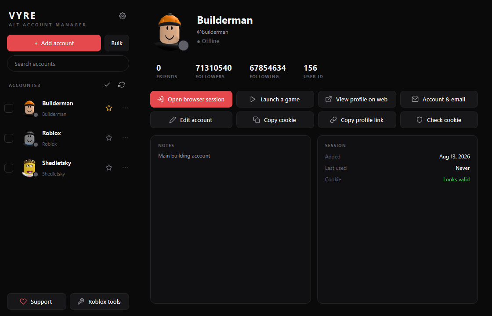
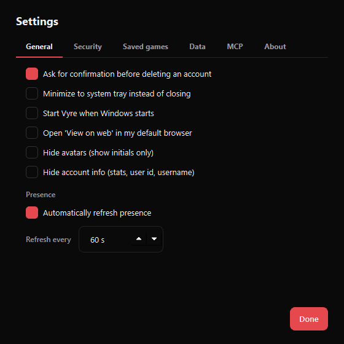
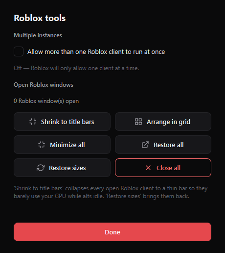

# Vyre

A clean, professional Roblox alt account manager for Windows — Onyx/Crimson UI,
encrypted vault, embedded Chromium, live presence, and one-click game launching.

[](https://github.com/ImKyrro/vyre/releases/latest)

### ⬇ [Download the latest Vyre.exe](https://github.com/ImKyrro/vyre/releases/latest/download/Vyre.exe)

No install needed — download and run. Windows may show a one-time SmartScreen
prompt (More info → Run anyway) since the build isn't code-signed yet.



<p align="center">
  
  
</p>

## Features

**Accounts**
- Store unlimited accounts with real Roblox avatars and per-account accent colors
- Favorites (star), reorder (move up/down), duplicate, search
- Rich detail view: display name, user id, friends / followers / following stats

**Logging in (multiple ways)**
- Paste a `.ROBLOSECURITY` cookie
- Sign in through a secure in-app Roblox window (session captured automatically)
- Enter a username & password — Vyre fills the login form; you solve any puzzle
- Bulk import many cookies, or a list of `username:password` lines at once

**Browsing & sessions**
- Embedded Chromium (QtWebEngine) with back / forward / reload / home / open-external
- Every account runs in its own isolated browser profile
- View any account's profile on the web (in-app or your default browser)

**Presence**
- Live status for every account: Online / In game / In Studio / Offline
- See the game an account is currently in, and jump straight into their server
- Auto-refresh on a configurable interval

**Launching games**
- Launch any game by Place ID or link, as a chosen account (auth-ticket based)
- Join a specific server by Job ID
- Join private servers by link or access code
- Built-in server browser with player counts — pick a server and join
- Saved games for one-click launching
- **Multi-select** accounts and mass-launch them into a game, or follow a user /
  friend into their game, with a configurable stagger between launches

**Multiple instances & window tools** (Roblox tools)
- Allow more than one Roblox client to run at once (holds the singleton handle)
- Minimize all, restore all, or tile every open Roblox window into a grid
- Lower Roblox clients' CPU/GPU priority so background alts stop hogging the machine
- Close all clients; live count of open windows

**Account upkeep**
- Auto-fills each account's user id, avatar, and presence in the background
- Open any account's Roblox account/email settings page in its own session
- "Back to Vyre" button to return from any web view

**Security & data**
- Master password encrypts the vault (PBKDF2 + Fernet); cookies never in plaintext
- Change master password, export / import an encrypted vault
- Clear browser sessions, open data folder

**System integration**
- Compact windowed app, desktop + Start Menu shortcuts, custom icon
- Optional: start with Windows, minimize to system tray
- Ships an **MCP server** so AI clients can list accounts, check presence,
  browse servers, and launch games

## Requirements

- Windows, Python 3.10+ (tested on 3.14)

## Setup

```bash
pip install -r requirements.txt
python make_shortcut.py
```

Regenerate the icon only if you change `build_icon.py`:

```bash
python build_icon.py
```

## Run

Double-click **Vyre** (desktop/Start Menu), or:

```bash
python run.py
```

To pin to the taskbar: launch Vyre, right-click its taskbar icon, choose
**Pin to taskbar** (Windows blocks silent pinning).

First launch sets a master password. It encrypts your vault and cannot be
recovered, so keep it safe.

## MCP server

Vyre exposes an MCP server (`python -m vyre.mcp_server`) with tools:
`list_accounts`, `account_presence`, `game_info`, `list_servers`, `launch_game`.
It reads the vault using the `VYRE_MASTER_PASSWORD` environment variable. Copy a
ready-made client config from **Settings → MCP**.

## Where data is stored

Everything lives under `%APPDATA%\Vyre`:

- `vault.dat` — encrypted accounts
- `config.json` — settings
- `profiles\` — per-account browser sessions

## Support

Made by **Kyrro**. If Vyre helps you, tips are appreciated (game pass support is
coming soon):

- Litecoin (LTC): `LSmU3RodML3p2HvwN2wU4HUJZSJddMxUJW`
- Discord: `kyrro_real`

Open **♥ Support** in the app to copy these.

## Notes

Vyre stores your own account sessions locally and only talks to Roblox. Keep your
master password private — anyone with it and the vault file can read your cookies.
Launching a specific account uses Roblox's authentication-ticket flow; if a ticket
can't be obtained it falls back to a standard deep link.
